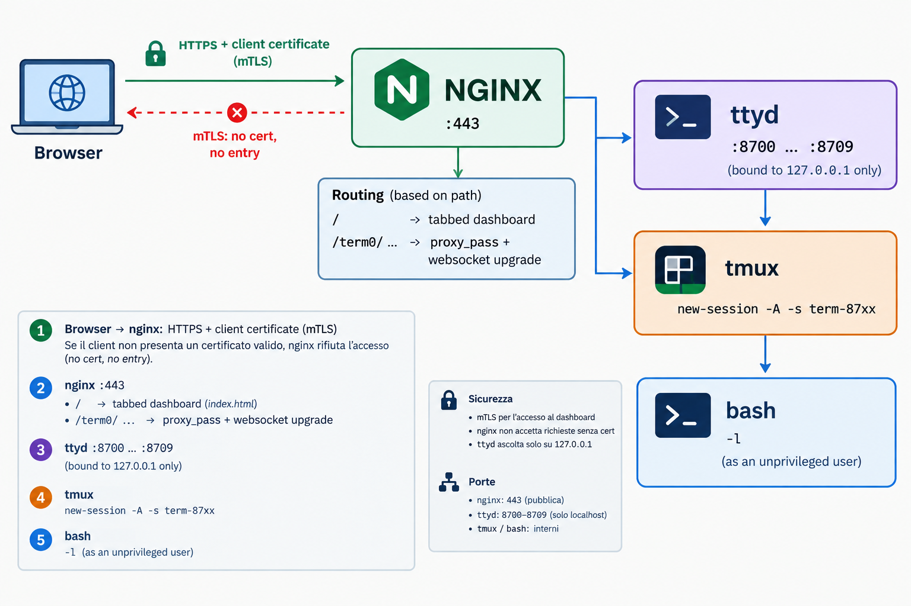

<p align="center">
  <picture>
    <source media="(prefers-color-scheme: dark)" srcset="design/marchio/firma-en.svg">
    
  </picture>
</p>

# tmux-web: persistent browser terminals behind mutual TLS

Terminals in your browser that survive when you close the page. Each one is a `tmux`
session, served by [`ttyd`](https://github.com/tsl0922/ttyd). The only way in is a
**client certificate**.

These are real shells on a public port: read the [gotchas](#gotchas-all-of-them-found-the-hard-way)
before you put it online.

Settings, script internals and code comments are in Italian.

*Documentazione in italiano: [README.it.md](README.it.md).*



*Diagram courtesy of ChatGPT.*

Three parts, one job each:

- **tmux** keeps the session alive. Close the browser, the work goes on.
- **ttyd** turns the terminal into a websocket. It listens on `127.0.0.1` only: it has no
  password, and nobody outside must reach it.
- **nginx** does TLS, mutual TLS and proxying. It is the only way in: it decides who enters.

## Requirements

- Rocky/RHEL/Alma 9 with EPEL (that is where `ttyd` lives), or Fedora, where `ttyd` is in
  the base repositories and EPEL is not needed. Tested on Rocky Linux 9 and Fedora 39.
- `ttyd`, `tmux`, `nginx`, `openssl`: `install.sh` installs them with `dnf`.
- Debian/Ubuntu: almost everything applies. Three things change: `apt install ttyd tmux
  nginx`, the vhost goes in `/etc/nginx/sites-available` with a symlink in `sites-enabled`,
  and there is no SELinux (AppArmor normally does not get in the way).
- The **browser** needs internet access, because Bootstrap comes from a CDN. The server does
  not. For a closed network: put the two files in the webroot and change the two URLs in
  `conf/index.html.tmpl`.

## Install

```bash
# 1. say who and where
$EDITOR impostazioni.conf          # at minimum DOMINIO and UTENTE

# 2. install (as root)
sudo ./install.sh

# 3. take the client certificate with you and import it into your browser
scp root@SERVER:/root/certs-client/primo-accesso.p12 .
```

On the first run, from a terminal, `install.sh` asks a few questions:

1. **The site name.** If nginx already serves it on 443, the terminals go under one of its
   paths (default `/term`), and it offers to adopt the site's client CA. Otherwise they get
   their own URL.
2. **How many terminals, and which user** the shells run as. If the user does not exist, it
   creates it.
3. **The server certificate**, if `SSL_CRT` does not exist yet. It looks for valid ones for
   `DOMINIO` (the ones nginx uses, plus `/etc/letsencrypt/live/*`) and asks which to use.
   `--force` skips the search and makes a self-signed one.

A wrong answer is asked again: the script does not stop. Answers go to
`impostazioni.locale.conf` and are not asked again. To answer again, delete that file.
Without a terminal the defaults apply.

At the end it runs `./verifica.sh`. It checks that the terminals are up, that **you cannot
get in without a certificate**, and that with one the dashboard and every `/termN/` return
200.

You can re-run `install.sh` any time: it realigns everything and backs up whatever it
overwrites. `--salta-pacchetti` skips `dnf`.

The number of terminals lives in one place: `N_TERM`. Tabs, nginx `upstream` and `location`
blocks and systemd units are all generated from it.

### First access: importing the certificate

You cannot download the certificate from the service: without a certificate you cannot get
in. Copy it with `scp` and import it by hand.

- **Chrome / Chromium / Edge** — Settings > Privacy and security > Security > Manage
  certificates > *Your certificates* > Import.
- **Firefox** — Settings > Privacy & Security > Certificates > View Certificates >
  *Your Certificates* > Import. Firefox has its own store, not the system one.
- **iOS / macOS** — the `.p12` installs as a profile. On iOS you then have to *enable* it
  under Settings > General > About > Certificate Trust Settings.
- **Android** — Settings > Security > Credentials > Install from storage, and choose
  "VPN & app certificate".

The `.p12` is in **legacy** format (3DES/SHA1) on purpose: the iOS/macOS keychain rejects
the OpenSSL 3 default (AES-256 + PBKDF2). To read it from the command line you need
`-legacy`, or OpenSSL 3 stops with `RC2-40-CBC: unsupported`:

```bash
openssl pkcs12 -info -nokeys -legacy -in /root/certs-client/primo-accesso.p12
```

### Adding devices

```bash
sudo certs/emetti-client.sh phone-alice        # one certificate per device
sudo certs/emetti-client.sh laptop-alice 365   # lifetime in days
```

One certificate per **device**, not per person: lose a phone, and you throw away only that
one. Revoking a single certificate would need a CRL, and there is none. With a handful of
devices it is quicker to make a new CA and reissue.

### Under a path of an existing site

With `PREFISSO=/term` no new `server{}` is created. The service lives at
`https://DOMINIO/term/`, inside the site's https `server{}`, with the site's certificate and
client CA.

```bash
# impostazioni.locale.conf
: "${DOMINIO:=www.example.com}"
: "${PREFISSO:=/term}"
: "${CA_CRT:=/etc/pki/example-ca/ca.crt}"   # the site's ssl_client_certificate
: "${CA_KEY:=/etc/pki/example-ca/ca.key}"
```

- `install.sh` looks for the site's file in `/etc/nginx/conf.d` (`server_name DOMINIO` +
  443). It stops if `ssl_verify_client optional|on` is missing, or if the site's CA is not
  `CA_CRT`.
- Locations go to `INCLUDE_PATH` (`/etc/nginx/terminali-path.inc`), upstreams and maps to
  `VHOST`.
- It adds the `include` line to the site's `server{}` after asking you, with a backup. If
  `nginx -t` fails, it takes it out again.
- Every location checks `$ssl_client_verify` itself: the rest of the site can stay public.
- The dashboard goes to `/usr/share/nginx/terminali`, not into the site's root.
- Port 80 is left to the site.

### Adopting an existing installation

The defaults in `impostazioni.conf` assume a clean machine. On a server that already has a
hand-made setup they will not match, and running `install.sh` with the wrong defaults does
damage:

- `DOMINIO` defaults to `hostname -f`: the machine's internal name, not necessarily the one
  people reach it by, or the one in the certificate.
- `CA_CRT` points to a file that does not exist. **This one locks you out**: a new CA is
  created, nginx trusts only that one, and every client certificate already issued stops
  working. `crea-ca.sh` stops if it finds only half of the CA, but it can only notice when
  the old file sits exactly at the configured path.
- `SSL_CRT`: a real certificate saved under another name is not found, and a self-signed one
  is made in its place.
- `VHOST` defaults to `terminali.conf`: an existing vhost with another name is not replaced
  but *joined*. Two servers on 443, and nginx keeps the first.

Put the real values in `impostazioni.locale.conf`. It is read **before** the defaults, and
git does not track it:

```bash
cat > impostazioni.locale.conf <<'EOF'
: "${DOMINIO:=term.example.com}"
: "${UTENTE:=someone}"
: "${SSL_CRT:=/etc/nginx/ssl/wildcard.example.com.crt}"
: "${SSL_KEY:=/etc/nginx/ssl/wildcard.example.com.key}"
: "${CA_CRT:=/etc/ssl/certs/whatever-the-existing-ca-is-called.crt}"
: "${CA_KEY:=/etc/ssl/private/whatever-the-existing-ca-is-called.key}"
: "${VHOST:=/etc/nginx/conf.d/www.conf}"
EOF
```

Keep the `: "${VAR:=value}"` form. The order is
**environment > `impostazioni.locale.conf` > `impostazioni.conf`**. Derived values (like `SSL_CRT` from `DOMINIO`) are computed after,
so they follow the real values, not the defaults.

Look before you leap: `./verifica.sh` changes nothing and tells you the current state, and
`install.sh` prints its full summary before touching anything.

### Maintenance

| Task | How |
|---|---|
| Change the number of terminals | `N_TERM` in `impostazioni.conf`, then `./install.sh --salta-pacchetti` |
| Reduce `N_TERM` | surplus units keep running: `systemctl disable --now ttyd@8709` by hand |
| CA expired | `sudo certs/rinnova-ca.sh`: re-signs with the **same** key and DN, so client certificates stay valid |
| Server certificate expired | regenerate it with `certs/cert-server.sh`, or point `SSL_CRT`/`SSL_KEY` at a real one |
| See what is running | `systemctl status 'ttyd@*'`, `runuser -u USER -- tmux ls` |
| Strict or diagnostic mTLS | `VERIFICA_CLIENT` (`on` / `optional`), then `./install.sh --salta-pacchetti` |
| Close port 80 as well | `PROTEGGI_80` (`nome` / `default` / `no`), then `./install.sh --salta-pacchetti` |
| Tie tab names to the user | `PROFILI` (`si` / `no`), then `./install.sh --salta-pacchetti` |
| Reset somebody's profile | `rm $DIR_PROFILI/<cn>.json`: it is recreated on their next visit |
| Turn off automatic names for everyone | `set -g set-titles off` in `conf/tmux-terminali.conf`, then `./install.sh --salta-pacchetti` |
| Add favicons | `design/esporta.py` generates them into `conf/icone/` from the mark in `design/marchio/`, then `./install.sh --salta-pacchetti` |
| Change or add an icon | `design/icone/icone.json`, then `design/esporta.py --solo-icone` and `./install.sh --salta-pacchetti` (see `design/ICONE-E-MARCHIO.md`) |
| Check a running installation | `sudo ./verifica.sh`: changes nothing, and checks the clear-text side too |

## Gotchas, all of them found the hard way

**mTLS: `on` or `optional`.** `VERIFICA_CLIENT` in `impostazioni.conf` decides. The default
is `on`.

- **`on`**: nginx demands the certificate during the TLS handshake. Without one, the request
  dies with `400 No required SSL certificate was sent` and never reaches a `location`.
- **`optional`**: the connection gets in, and the vhost turns it away with
  `if ($ssl_client_verify != SUCCESS) { return 403; }`. The page tells you *which* case it
  is: no certificate, an expired one, or the wrong CA. Handy when you are locked out of your
  own server.

Under `optional`, **that check is the only protection**. Delete it and anyone who reaches
443 gets a shell: writable, and with `sudo` if the user has it. That really happened, for
half a day. This is why the check is generated under `on` too: there it never fires, but
switching to `optional` stays a single variable.

**Port 80 is not yours.** mTLS guards 443, not 80. nginx ships with

```nginx
server { listen 80; server_name _; root /usr/share/nginx/html; }
```

which serves **the same webroot as the dashboard**, in the clear, asking nobody for
anything. The terminals are not there (`/term0/` and friends are 404). What leaks is the
dashboard page and, far worse, *any file left in the webroot*. `PROTEGGI_80` decides how far
to close it:

| value | what it installs | covers |
|---|---|---|
| `nome` (default) | a port-80 server for `$DOMINIO` only, `301` to https | `http://your.host/…` |
| `default` | the above, plus `listen 80 default_server` answering `444` | also the bare IP and unknown `Host:` headers |
| `no` | nothing | nothing |

On a dedicated host, use `default`. It is not the default because it is the only part that
changes the machine *outside* the terminals: on a shared server it silences any other http
site that has no `server_name` of its own.

None of the three is the real protection. The real protection is: **no keys or certificates
ever live in the webroot**. See the next one.

**Never put the `.p12` in the webroot.** It looks handy for importing from a phone. But the
stock port-80 server serves the webroot too, in the clear, with no certificate. A `.p12`
there is the service's only key, published on the internet, behind a passphrase anyone can
try to guess offline, at leisure. That is why the scripts write it to `/root/certs-client`
with mode `0600`. `install.sh` refuses to run while any `.p12`, `.key`, `.pem`, `.crt` or
`.csr` sits in the webroot. `verifica.sh` checks the same, and prints the plain-http URL the
file can be downloaded from.

**SELinux.** In **enforcing** mode nginx cannot connect to ttyd: `proxy_pass` returns 502 and
`audit.log` shows `name_connect`. `install.sh` sets `httpd_can_network_connect=1`. The
original host never hit this because it runs in *permissive* mode.

**ttyd is read-only by default** since 1.7.0. Without `-W` you can watch the terminal but not
type. `-W` is in the unit file.

**`tmux new-session -A`** attaches to the session if it exists, and creates it otherwise.
That is what makes the terminal persistent. The flip side: `exit` ends the session for good,
and the next connection gets a new, empty one.

**`KillMode=process` in the unit. It matters.** The tmux server is started by the *first*
`tmux new-session`, so it lands in that `ttyd@` unit's cgroup. With the default `KillMode`
(`control-group`), stopping that unit kills its whole cgroup: the tmux server, and with it
**every** session, not just its own. `install.sh` restarts every port, so it wiped the work
in all terminals. On a live machine: ten sessions, one tmux server, sitting in `ttyd@8708`'s
cgroup. One `systemctl restart ttyd@8708` would have closed them all.

With `KillMode=process` only `ttyd` stops: tmux stays, and `-A` finds the session again. **If
you are updating an old installation**, the first `install.sh` still wipes everything.
Install the new unit and run only `systemctl daemon-reload`, no `restart`: the new
`KillMode` takes effect at the next restart.

**Websocket timeouts.** The vhost sets `proxy_read_timeout 1d`. With the 60s default, nginx
closes an idle session and the terminal goes into reconnect. The original host never noticed
because tmux's status line refreshes every 15s and keeps the line busy: it worked by
accident.

**Favicons are generated from what exists.** `index.html` gets one `<link>` per icon actually
present in the webroot (or in `conf/icone/`, from which `install.sh` copies them). A `<link>`
to a missing file is a 404 on every page load. The binaries are not in the repo: a server
that already has them keeps them across reinstalls.

**Profiles need no backend.** Tab names, open terminals, their order and the grid live in one
JSON per identity. nginx serves it and writes it: Rocky's package has `ngx_http_dav_module`
compiled in, so it accepts the `PUT` on its own. No extra process, no new port, all behind
the mTLS that is already there.

The identity is the client certificate's **CN**. nginx has no variable for the CN, only the
whole DN, so a `map` pulls it out. Mind the format: `$ssl_client_s_dn` is RFC2253, which
prints the DN *reversed*, and an `emailAddress`, if present, comes **before** the CN. So the
regex looks for it mid-string, not at the start.

The file name must be exactly the identity. A backreference in a second `map` guarantees it:

```nginx
map "$cn_client:$uri" $profilo_mio {
    default                                   0;
    "~^([A-Za-z0-9._-]+):/profili/\1\.json$"  1;
}
```

So the path coming from the browser does not matter: reading or writing someone else's
profile is a 403. A CN that is missing, empty, too long, or has characters that do not belong
in a file name becomes an empty identity: nothing is read, nothing is written.

Worth remembering:

- **One certificate per device means one profile per device.** Two browsers with the same
  `.p12` share names. A phone and a laptop with different certificates stay separate.
- **Last writer wins, not last loader.** With two browsers open there is no merge: whoever
  renames last overwrites. "Last" is decided by a timestamp. Every local change stamps
  `localStorage`, and the `PUT` carries that stamp in an `agg` field. On load, if the local
  stamp is newer than the profile's, the cache wins and goes up to the server. Otherwise the
  profile wins. Without this, reloading within the 800ms debounce (or after a rejected `PUT`,
  or with no network) brought the old names back. Clocks on different machines can drift,
  but the case that matters (change here, reload here) is the same browser. On top of that, a
  pending `PUT` is sent right away on `pagehide` and when the page goes to the background,
  with `keepalive` (or the browser would cancel it).

**When a session dies, the name reverts on the server too.** It used to stay in the browser,
for a reason: the only hint was ttyd's "Connection Closed", and with that an nginx restart
would have wiped the names in every browser of that identity. Now the hint is the tmux
client's `[exited]`, which only appears when the session really ended. And an ended session
has ended for every device. The same goes for closing the tab.

**How you know the shell has died.** ttyd writes "Connection Closed" both when the session
ends and when only the line drops. In the first case the tab closes; in the second, the right
move is to wait for ttyd to reattach. So what is read is what the **tmux client** leaves on
screen when it exits: it leaves the alternate screen (`ESC [ ? 1049 l`), clears, and prints

```
[exited]
```

That line lands in `xterm.js`'s buffer and is read from there. Verified on **tmux 3.2a** by
recording a real client's pty. A dropped line does not print it: the process is killed, and
the screen stays as it was. The check repeats for a couple of seconds after ttyd's notice,
because `xterm.js` writes asynchronously. If some tmux version did not print that line, the
tab would stay open and you would close it with the `✕`: you lose the convenience, not the
work.

**How you know copy-mode is on.** Not by counting clicks on the button: with a real keyboard
you can enter and leave on your own. What is read is what **tmux draws**: in copy-mode it
writes `[line/total]` at the pane's top right, and that lands in xterm.js's buffer. Verified
on a real tmux client: entering copy-mode shows `[0/179]`.

- `capture-pane` does **not** show it: it captures the pane, but the client draws the
  indicator. To see it, record the pty of an attached client
  (`script -f ... -c "tmux attach -t ..."`).
- A bare `[n/m]` is not enough: a progress bar printing `[1/10]` would light it up. tmux draws
  its indicator with `mode-style`, `bg=yellow` by default, so the cells' **background** is
  checked too.
- Leaving sends **Esc**, not `q`. Esc cancels copy-mode in both of tmux's key tables
  (`copy-mode` and `copy-mode-vi`), and does no harm outside copy-mode. `q` would type a
  letter into the shell.

**Arrow keys have two forms.** With application cursor mode on (DECCKM, which `vi` and
full-screen programs set) an arrow is `ESC O A`. Otherwise it is `ESC [ A`. So the key bar
checks `term.modes.applicationCursorKeysMode` before choosing. `Esc` is `ESC`, `Tab` is `HT`
(0x09), `PgUp`/`PgDn` are `ESC [ 5~` and `ESC [ 6~`: the same sequences xterm.js sends.

**Clipboard and OSC 52.** In ttyd's **1.7.7** bundle from EPEL, xterm.js handles OSC 0, 1, 2,
4, 8, 10–12, 104, 110–112 and 1337. **52**, the one a program uses to say "put this on the
clipboard", **is missing**: the request was dropped without a word. The dashboard adds it,
with `term.parser.registerOscHandler(52, …)`. tmux needs no change: Claude Code copies with
`tmux load-buffer -w`, and with `-w` tmux itself sends `ESC ] 52 ; ; <base64> BEL` to the
client, even with `set-clipboard` at its default `external`. Verified on a tmux 3.5a client,
and on the whole chain (tmux → ttyd 1.7.7 → xterm.js → handler) with headless Chrome. Write
only: a read request (`?`) is ignored. The price is OSC 52's usual one: whatever is printed in
a terminal can write the clipboard, as in kitty, WezTerm or iTerm2. For programs that do not
copy on their own there is **Congela** (freeze, `Ctrl+Alt+C`).

## License

The Gratitude & Random Kindness License — the MIT License, with a wish.
Legally it is plain MIT: declare it as `MIT` wherever a license identifier is
required. See [LICENSE](LICENSE) (English, binding) and
[LICENSE.it.md](LICENSE.it.md) (Italian courtesy translation).
